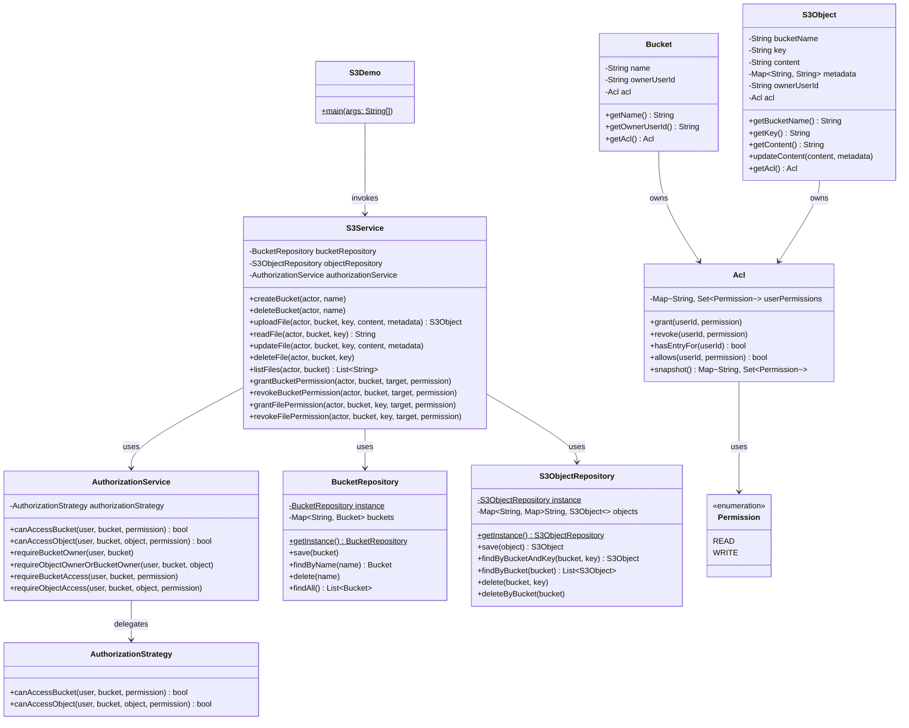

# S3 Module Architecture

This document contains a structured overview and interactive UML diagrams for the **S3** simplified object storage system module.

## Core Components
- **`S3Service`**: The primary API gateway orchestrating bucket creation, deletion, file management, and ACL configurations.
- **`AuthorizationService`**: Decouples auth checks from business logic, querying the configured policy strategy.
- **`AuthorizationStrategy`**: Contains concrete auth verification logic.
- **`Acl`**: Models access control lists using a map of users to sets of permissions.
- **`Bucket` & `S3Object`**: Core entities owning an `Acl`.

---

## 1. Class Diagram (Mermaid)

Below is the class diagram illustrating classes, variables, and relations.



---

## 2. Dynamic Interaction Sequence (Mermaid)

The sequence diagram below visualizes the execution flow of **`updateFile`** verifying permissions, showing the interaction between the service, authorization strategy, and ACL.

```mermaid
sequenceDiagram
    autonumber
    actor Actor as Charlie
    participant Service as S3Service
    participant Auth as AuthorizationService
    participant Strategy as AuthorizationStrategy
    participant Obj as S3Object
    participant ObjAcl as Object Acl
    participant BktAcl as Bucket Acl

    Actor->>Service: updateFile(Charlie, "docs", "design.txt", "v3 design", metadata)
    Service->>Auth: requireObjectAccess(Charlie, bucket, object, WRITE)
    Auth->>Strategy: canAccessObject(Charlie, bucket, object, WRITE)
    
    rect rgb(240, 248, 255)
        Note over Strategy: Check Ownership
        Strategy-->>Strategy: isOwner(Charlie)? -> False
    end

    Strategy->>Obj: getAcl()
    Obj-->>Strategy: objectAcl
    Strategy->>ObjAcl: hasEntryFor(Charlie)
    
    alt Object ACL has entry for user
        ObjAcl-->>Strategy: true
        Strategy->>ObjAcl: allows(Charlie, WRITE)
        ObjAcl-->>Strategy: result (true/false)
    else Object ACL has no entry
        ObjAcl-->>Strategy: false
        Strategy->>BktAcl: allows(Charlie, WRITE)
        BktAcl-->>Strategy: result (true/false)
    end

    Strategy-->>Auth: canAccess (e.g. false)
    
    alt Access Denied
        Auth-->>Service: throw SecurityException("Access Denied")
        Service-->>Actor: propagates SecurityException
    else Access Allowed
        Auth-->>Service: success
        Service->>Obj: updateContent("v3 design", metadata)
        Service-->>Actor: void
    end
```
